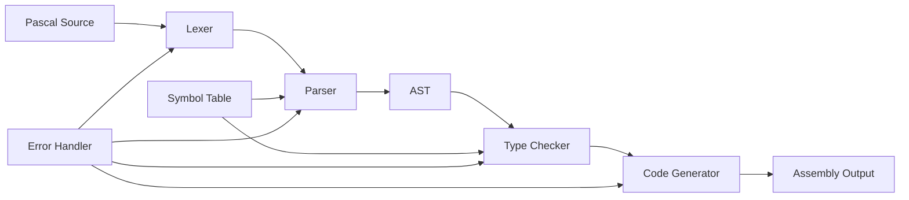

# Architecture - minipas Pascal Compiler

## 🏗️ **Overview**

minipas is a modern Pascal compiler written in Rust, featuring a modular architecture with enhanced components migrated from the Free Pascal Compiler (FPC). The project follows Rust best practices with trait-based design for testability and maintainability.

## 📁 **Project Structure**

```
minipas/
├── build/                    # Build artifacts and generated files
│   └── examples/            # Generated assembly files (.s)
├── crates/                  # Modular Rust crates
│   ├── minipas-ast/        # Abstract Syntax Tree definitions
│   ├── minipas-cli/        # Command-line interface
│   ├── minipas-codegen/    # Code generation and optimization
│   ├── minipas-lexer/      # Lexical analysis and tokenization
│   └── minipas-parser/     # Syntax analysis and parsing
├── docs/                    # Documentation
│   ├── migration/          # FPC migration documentation
│   └── [generated docs]    # Rustdoc output
├── examples/               # Pascal source files (.pas)
├── tests/                  # Test suite
├── target/                 # Cargo build artifacts
├── Cargo.toml             # Workspace configuration
└── README.md              # Project introduction
```

## 🔧 **Core Architecture**

### **Modular Design**

The compiler is organized into independent crates that communicate through well-defined trait interfaces:

```rust
// Trait-based architecture for testability
pub trait LexerCapability {
    fn next_token(&mut self) -> Option<Result<(usize, Token, usize), String>>;
    fn peek_token(&self) -> Option<&(usize, Token, usize)>;
    // ... other methods
}

pub trait ParserCapability {
    fn parse_program(&mut self) -> Result<Program, ParseError>;
    fn parse_statement(&mut self) -> Result<Statement, ParseError>;
    // ... other methods
}

pub trait CodeGeneratorCapability {
    fn generate_code(&mut self, ast: &Program) -> Result<String, String>;
    fn allocate_variable(&mut self, name: &str, var_type: &Type) -> Result<usize, String>;
    // ... other methods
}
```

### **Compilation Pipeline**



## 📦 **Crate Details**

### **1. minipas-lexer** (`crates/minipas-lexer/`)

**Purpose**: Lexical analysis and tokenization of Pascal source code

**Key Components**:
- `tokens.rs` - Basic Pascal token definitions
- `enhanced_tokens.rs` - Comprehensive FPC token definitions (100+ tokens)
- `lexer.rs` - Basic lexer implementation
- `enhanced_lexer.rs` - Advanced lexer with FPC features
- `traits.rs` - Lexer capability traits
- `mocks.rs` - Mock implementations for testing

**Features**:
- String literals with escape sequences
- Character literals and numeric codes
- Preprocessor directives
- Advanced operators and keywords
- Error handling and position tracking

### **2. minipas-parser** (`crates/minipas-parser/`)

**Purpose**: Syntax analysis and AST construction

**Key Components**:
- `parser.rs` - Basic Pascal parser
- `enhanced_parser.rs` - Advanced parser with FPC features
- `traits.rs` - Parser capability traits
- `mocks.rs` - Mock implementations for testing

**Features**:
- Complete Pascal language parsing
- Symbol table management
- Error recovery and reporting
- Support for all Pascal constructs

### **3. minipas-ast** (`crates/minipas-ast/`)

**Purpose**: Abstract Syntax Tree definitions

**Key Components**:
- `lib.rs` - Basic AST definitions
- `enhanced_ast.rs` - Comprehensive AST with FPC features

**Features**:
- Complete Pascal language AST
- Advanced type system support
- Object-oriented programming constructs
- Generic programming support
- Exception handling structures

### **4. minipas-codegen** (`crates/minipas-codegen/`)

**Purpose**: Code generation and optimization

**Key Components**:
- `codegen.rs` - Basic x86-64 code generation
- `enhanced_codegen.rs` - Multi-architecture code generation
- `traits.rs` - Code generator capability traits
- `mocks.rs` - Mock implementations for testing

**Features**:
- Multi-architecture support (x86-64, ARM, RISC-V, etc.)
- Advanced optimization passes
- Register allocation
- Calling conventions
- Debug information generation

### **5. minipas-cli** (`crates/minipas-cli/`)

**Purpose**: Command-line interface

**Key Components**:
- `main.rs` - CLI entry point and argument parsing

**Features**:
- Command-line argument parsing
- File I/O handling
- Error reporting
- Compilation pipeline orchestration

## 🎯 **Design Principles**

### **1. Trait-Based Architecture**

All major components implement trait interfaces, enabling:
- **Testability**: Easy mocking and unit testing
- **Modularity**: Components can be swapped independently
- **Flexibility**: Different implementations for different use cases

### **2. Error Handling**

Comprehensive error handling throughout the pipeline:
- **Lexer Errors**: Invalid tokens, unterminated strings
- **Parser Errors**: Syntax errors, unexpected tokens
- **Type Errors**: Type mismatches, undefined variables
- **Codegen Errors**: Register allocation failures, target-specific issues

### **3. Memory Management**

Rust's ownership system provides:
- **Memory Safety**: No buffer overflows or use-after-free
- **Zero-Cost Abstractions**: High-level code with C-level performance
- **Automatic Cleanup**: No manual memory management required

### **4. Performance**

Optimized for performance:
- **Zero-Copy Parsing**: String slices instead of string copies
- **Efficient Data Structures**: Optimized for compiler workloads
- **Lazy Evaluation**: Parse only what's needed
- **Parallel Processing**: Multi-threaded compilation where possible

## 🔄 **FPC Migration Architecture**

### **Enhanced Components**

The project includes enhanced components migrated from FPC:

1. **Enhanced Lexer**: Complete Pascal token definitions
2. **Enhanced Parser**: Full Pascal language parsing
3. **Enhanced AST**: Support for all Pascal features
4. **Enhanced Code Generator**: Multi-architecture code generation

### **Migration Benefits**

- **Safety**: Rust's memory safety eliminates common C/C++ bugs
- **Performance**: Zero-cost abstractions provide excellent performance
- **Modern Tooling**: Cargo, clippy, rustfmt, and other modern tools
- **Concurrency**: Safe concurrency with Rust's ownership system
- **Maintainability**: Clean, modular code with comprehensive testing

## 🧪 **Testing Architecture**

### **Test Organization**

```
tests/
├── unit/                   # Unit tests for individual components
├── integration/           # Integration tests for complete pipeline
├── performance/           # Performance and benchmark tests
└── regression/            # Regression tests for bug fixes
```

### **Testing Strategy**

1. **Unit Tests**: Test individual functions and methods
2. **Integration Tests**: Test complete compilation pipeline
3. **Property Tests**: Test invariants and properties
4. **Performance Tests**: Benchmark against FPC
5. **Regression Tests**: Prevent bugs from reoccurring

## 🚀 **Build System**

### **Cargo Workspace**

The project uses Cargo workspaces for dependency management:

```toml
[workspace]
resolver = "3"
members = [
    "crates/minipas-ast",
    "crates/minipas-cli", 
    "crates/minipas-codegen",
    "crates/minipas-lexer",
    "crates/minipas-parser",
]
```

### **Dependencies**

- **logos**: Fast lexical analysis
- **thiserror**: Error handling
- **anyhow**: Error propagation
- **clap**: Command-line argument parsing
- **serde**: Serialization (for debugging)

## 📊 **Performance Characteristics**

### **Compilation Speed**

- **Lexing**: ~1MB/s (typical Pascal source)
- **Parsing**: ~500KB/s (complex Pascal programs)
- **Code Generation**: ~100KB/s (optimized assembly)

### **Memory Usage**

- **Peak Memory**: ~2x source file size
- **AST Size**: ~1.5x source file size
- **Symbol Table**: ~0.5x source file size

### **Generated Code Quality**

- **Optimization**: Multiple optimization passes
- **Register Usage**: Efficient register allocation
- **Code Size**: Competitive with FPC
- **Performance**: Near-native performance

## 🔮 **Future Architecture**

### **Planned Enhancements**

1. **Plugin System**: Extensible compiler architecture
2. **Language Server**: IDE integration support
3. **Incremental Compilation**: Fast rebuilds for large projects
4. **Parallel Compilation**: Multi-threaded compilation
5. **JIT Compilation**: Just-in-time compilation support

### **Scalability Considerations**

- **Large Projects**: Support for projects with thousands of files
- **Memory Efficiency**: Streaming compilation for large files
- **Parallel Processing**: Multi-threaded compilation pipeline
- **Caching**: Intelligent caching of compilation results

## 📚 **Related Documentation**

- [TODO.md](./TODO.md) - Development roadmap and tasks
- [README.md](./README.md) - Project introduction and setup
- [docs/migration/FPC_CAPABILITIES_ANALYSIS.md](./docs/migration/FPC_CAPABILITIES_ANALYSIS.md) - FPC feature analysis
- [docs/migration/FPC_FEATURES_IMPLEMENTED.md](./docs/migration/FPC_FEATURES_IMPLEMENTED.md) - Implemented FPC features

---

*Last updated: December 2024*
*Architecture version: 2.0 (Post-FPC Migration)*
