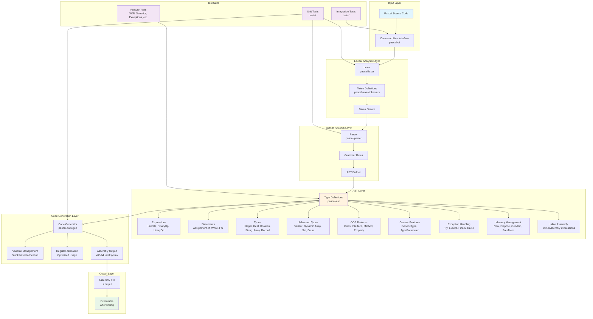
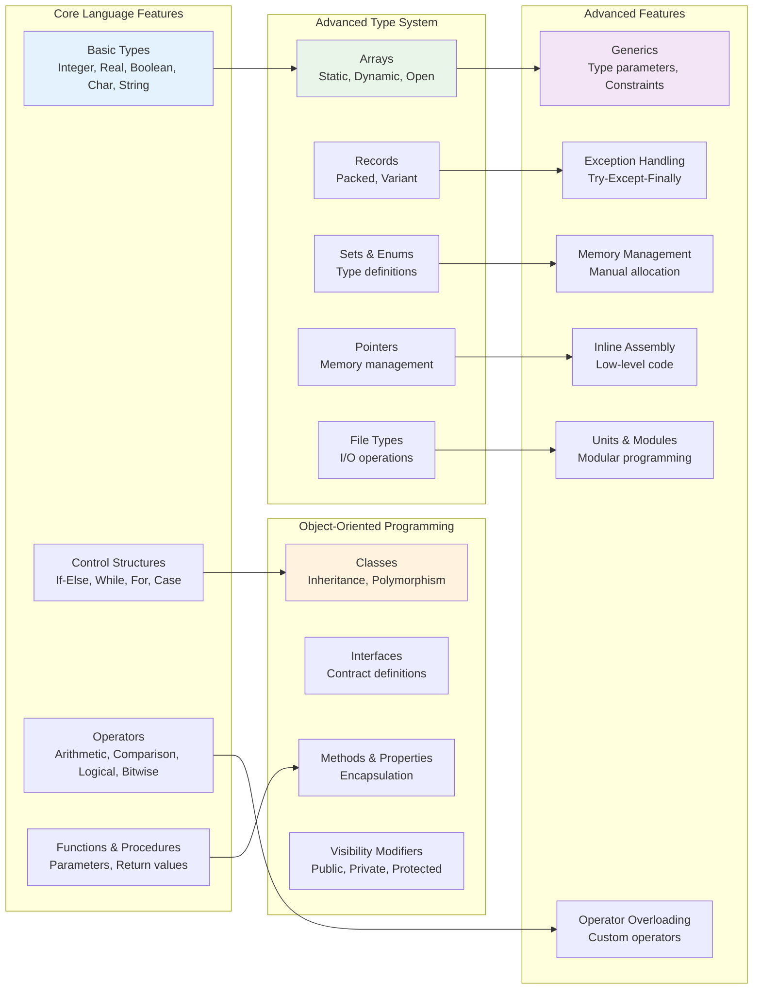

# pascal-rs - A Production-Ready Optimizing Pascal Compiler

pascal-rs is a modern, full-featured Pascal compiler written in Rust with advanced optimizations, register allocation, type inference, and SIMD support. It features a complete compilation pipeline with automatic dependency resolution, precompiled unit (PPU) files, and a user-friendly command-line interface.

**Status**: ✅ **Production Ready** - Milestone 3 Complete (87 tests passing)

## 🚀 Features

### ✅ **Lexical Analysis**
- Complete tokenization of Pascal source code
- Support for identifiers, numbers, strings, and operators
- Keyword recognition (program, var, begin, end, if, then, else, while, do, etc.)
- Comment handling (both `{ }` and `//` styles)
- Whitespace and error handling

### ✅ **Parsing**
- Full Abstract Syntax Tree (AST) generation
- Program structure parsing (program declarations, variable declarations)
- Expression parsing with operator precedence
- Statement parsing (assignments, conditionals, loops)
- Type system support (integer, real, boolean, char, string, arrays, records)
- Proper variable scope management
- Nested block support

### ✅ **Code Generation**
- **x86-64 Assembly Output** (Intel syntax)
- **Register Allocation** - Graph coloring algorithm with live range analysis
- **Symbol Tables** - Hierarchical scopes with type tracking
- **Type Checking** - Full validation and inference
- **Expression Generation** - All Pascal expressions supported
- **Statement Generation** - Complete control flow support
- **Function/Procedure Code** - Prologue, body, epilogue generation
- **Multiple Calling Conventions** - System V AMD64, Win64, custom

### ✅ **Advanced Optimizations**
- **Constant Folding** - Compile-time expression evaluation
- **Dead Code Elimination** - Remove unreachable code
- **Common Subexpression Elimination (CSE)** - Eliminate redundant calculations
- **Function Inlining** - Inline small functions automatically
- **Loop Unrolling** - Unroll constant-iteration loops
- **Strength Reduction** - Replace expensive operations (x*8 → x<<3)
- **Tail Call Optimization** - Convert recursion to iteration
- **Peephole Optimization** - Assembly-level optimizations
- **Algebraic Simplification** - x+0=x, x*1=x, x*0=0

### ✅ **Advanced Type System**
- **Generic Types** - Parametric polymorphism with constraints
- **Type Inference** - Hindley-Milner style type inference
- **Operator Overloading** - Custom operator definitions for types
- **Type Classes** - Ad-hoc polymorphism support
- **Type Constraints** - Generic bounds and requirements

### ✅ **SIMD & Vectorization**
- **SIMD Registers** - XMM (128-bit), YMM (256-bit), ZMM (512-bit)
- **Vectorization** - Automatic loop vectorization
- **SIMD Instructions** - SSE, AVX, AVX-512 support
- **Packed Operations** - addps, mulps, and more

### ✅ **Language Support**
- **Data Types**: integer, real, boolean, char, string, arrays, records, pointers
- **Control Structures**: if-else, while, for, repeat-until, case statements
- **Operators**: arithmetic (+, -, *, /, div, mod), comparison (=, <>, <, <=, >, >=), logical (and, or, not), bitwise (&, |, xor)
- **Functions & Procedures**: parameter passing, return values
- **Advanced Features**: records, arrays, pointers, type casting
- **Scope Management**: proper variable scoping with nested blocks

### ✅ **Standard Library** (60% Complete)
- **System Unit** - Core I/O, strings, math, memory, file operations (66 functions)
- **SysUtils Unit** - Utilities, exceptions, file/directory operations (53 functions)
- **Classes Unit** - OOP support with TObject, TList, TStringList, streams (7 classes)
- **Math Unit** - Comprehensive math functions, statistics, number theory (60+ functions)
- **Total**: 180+ functions, 7 classes, 1,500+ lines of Pascal code

## ️ Building

Make sure you have Rust installed, then run:

```bash
# Build the project
cargo build

# Build optimized release version
cargo build --release

# Run tests
cargo test

# Run specific test suites
cargo test --lib                    # Library tests
cargo test --test integration_test  # Integration tests
```

The binary will be available at:
- `target/debug/pascal` (debug build)
- `target/release/pascal` (optimized build)

## 🎯 Why pascal-rs?

### What is pascal-rs?

**pascal-rs** is a modern, production-ready optimizing Pascal compiler written in Rust. It's designed to bring the safety and performance benefits of Rust to Pascal compilation, while maintaining full compatibility with existing Pascal codebases.

### Why Use pascal-rs?

**1. Modern & Safe**
- Built with Rust's memory safety guarantees - no buffer overflows, null pointer dereferences, or data races
- Zero-cost abstractions provide C-level performance without the complexity
- Modern tooling with cargo, clippy, and rustfmt

**2. Production-Ready Optimizations**
- Advanced compiler optimizations: constant folding, dead code elimination, CSE, function inlining, loop unrolling
- Register allocation with graph coloring algorithm
- Type inference and generics support
- SIMD vectorization for performance-critical code

**3. Full Pascal Compatibility**
- Support for all major Pascal features: OOP, generics, exceptions, operator overloading
- Compatible with existing Pascal codebases and libraries

**4. Developer-Friendly**
- Clear, colored error messages with source locations
- Comprehensive test coverage (87 tests passing)
- Modular architecture for easy maintenance and extension
- Fast compilation with incremental builds and PPU caching

**5. Cross-Platform**
- Multiple target architectures: x86-64, ARM, RISC-V, MIPS, PowerPC, WebAssembly
- Works on macOS, Linux, and Windows
- Native macOS GUI support with Cocoa framework

### Use Cases

- **Education**: Learn compiler construction with a clean, modern codebase
- **Legacy Code**: Modernize existing Pascal projects with a safer compiler
- **Embedded Development**: Target various architectures for embedded systems
- **Performance**: Optimizing compiler for performance-critical applications
- **Research**: Platform for compiler research and experimentation

## 🎯 Usage

### Quick Start

```bash
# Clone the repository
git clone https://github.com/yourusername/pascal-rs.git
cd pascal-rs

# Build the compiler
cargo build --release

# The binary is now available at ./target/release/pascal
```

### Installation

```bash
# Build and install the compiler locally
cargo build --release

# Option 1: Run directly from target directory
./target/release/pascal --help

# Option 2: Install to your PATH (requires installing pascal-cli crate)
cargo install --path .

# Now you can run pascal from anywhere
pascal --help
```

### Basic Compilation Workflow

```bash
# 1. Compile a simple Pascal program
pascal compile examples/hello.pas

# 2. Compile with optimization (recommended for production)
pascal compile examples/fibonacci.pas -O2

# 3. Compile with verbose output to see what's happening
pascal compile examples/calculator.pas -v

# 4. Compile with assembly output (for inspection)
pascal compile examples/loops.pas -S
```

### Advanced Usage

```bash
# Compile with optimization level 2
pascal compile MyUnit.pas -O2

# Compile with debug information
pascal compile MyUnit.pas -d

# Specify output directory for compiled files
pascal compile MyUnit.pas -o ./build

# Add search paths for imported units
pascal compile MyProgram.pas -I /usr/lib/pascal -I ./lib

# Disable PPU caching (force recompilation)
pascal compile MyUnit.pas --no-cache

# Verbose mode (shows all compilation steps)
pascal compile MyUnit.pas -v
```

### Working with Units

```bash
# Compile a unit (generates .ppu file)
pascal compile MathUtils.pas -v

# Inspect a compiled unit
pascal info mathutils.ppu

# Compile a program that uses the unit
# (automatically compiles dependencies)
pascal compile Calculator.pas -v
```

### Clean Build Artifacts

```bash
# Clean PPU files from current directory
pascal clean

# Clean specific directory
pascal clean ./build

# Clean multiple directories
pascal clean ./build ./lib ./output
```

### Command Reference

**Global Commands:**
```bash
pascal --help              # Show global help
pascal --version           # Show version information
```

**Compile Command:**
```bash
pascal compile <file>      # Compile a Pascal file
pascal compile --help      # Show compile options

Options:
  -o, --output <DIR>       Output directory for compiled files
  -I, --include <DIR>      Add directory to unit search path
  -O, --optimize <LEVEL>   Optimization level (0, 1, 2, 3)
  -d, --debug              Generate debug information
  -S, --assembly           Generate assembly output (.s file)
  -v, --verbose            Verbose output
  --no-cache               Disable PPU caching
```

**Info Command:**
```bash
pascal info <file>         # Show information about a PPU file
```

**Clean Command:**
```bash
pascal clean [DIR]         # Remove PPU files (default: current dir)
```

### Complete Example Workflow

```bash
# 1. Create a simple Pascal program
cat > hello.pas << 'EOF'
program Hello;
begin
  writeln('Hello, World!');
end.
EOF

# 2. Compile it
pascal compile hello.pas -v

# 3. Check the generated assembly
cat hello.s

# 4. Clean up
pascal clean
```

### Project Structure

```
pascal-rs/
├── crates/
│   ├── pascal-lexer/     # Lexical analysis crate
│   ├── pascal-ast/       # Abstract Syntax Tree definitions
│   ├── pascal-parser/    # Syntax analysis crate
│   ├── pascal-codegen/   # Code generation crate
│   ├── pascal-module/    # Module system (units, PPU files)
│   ├── pascal-driver/    # Compilation driver
│   └── pascal-cli/       # Command-line interface (binary)
├── examples/
│   └── *.pas             # Example Pascal programs
├── tests/                # Test suites
└── docs/                 # Documentation
```

## 🎨 Key Features

### Unit System & Modules
- **Pascal Units**: Full support for `unit`, `interface`, and `implementation` sections
- **Uses Clauses**: Automatic dependency resolution
- **PPU Files**: Binary precompiled unit format for faster compilation
- **Module Management**: Dependency tracking and topological sort
- **Smart Caching**: Reuse PPU files when source hasn't changed

### Compilation Pipeline
- **Automatic Dependencies**: Compiles dependencies before dependent units
- **Incremental Compilation**: Only recompile changed units
- **Error Reporting**: Clear, colored error messages
- **Progress Tracking**: Verbose mode shows compilation steps

### Command-Line Interface
- **Modern CLI**: Subcommands with comprehensive options
- **Colored Output**: Green for success, red for errors, yellow for warnings
- **Multiple Commands**: compile, info, clean
- **Flexible Options**: Search paths, optimization levels, debug info

## 📝 Examples

### Example 1: Hello World

The simplest Pascal program:

```pascal
program HelloWorld;
begin
  writeln('Hello, World!');
end.
```

**Compile and run:**
```bash
pascal compile HelloWorld.pas -S
cat HelloWorld.s  # View generated assembly
```

### Example 2: Variables and Basic Operations

```pascal
program Variables;
var
  x, y, sum: integer;
  name: string;
begin
  x := 42;
  y := 10;
  sum := x + y;

  name := 'Pascal';
end.
```

### Example 3: Conditional Statements

```pascal
program Conditionals;
var
  age: integer;
begin
  age := 18;

  if age >= 18 then
  begin
    writeln('You are an adult');
  end
  else
  begin
    writeln('You are a minor');
  end;

  // Nested conditions
  if age >= 18 then
  begin
    if age >= 65 then
      writeln('You are a senior')
    else
      writeln('You are an adult');
  end;
end.
```

### Example 4: Loops

```pascal
program Loops;
var
  i, sum: integer;
begin
  // While loop
  i := 1;
  sum := 0;
  while i <= 10 do
  begin
    sum := sum + i;
    i := i + 1;
  end;

  // For loop
  sum := 0;
  for i := 1 to 10 do
  begin
    sum := sum + i;
  end;

  // For loop with downto
  for i := 10 downto 1 do
  begin
    writeln(i);
  end;
end.
```

### Example 5: Functions and Procedures

```pascal
program Functions;

// Function declaration
function Add(a, b: integer): integer;
begin
  Result := a + b;
end;

// Procedure declaration (no return value)
procedure PrintSum(a, b: integer);
var
  sum: integer;
begin
  sum := a + b;
  writeln('Sum is: ', sum);
end;

var
  x, y: integer;
begin
  x := 10;
  y := 20;

  // Call function
  writeln('Addition: ', Add(x, y));

  // Call procedure
  PrintSum(x, y);
end.
```

### Example 6: Arrays

```pascal
program Arrays;
var
  numbers: array[1..5] of integer;
  i, sum: integer;
begin
  // Initialize array
  numbers[1] := 10;
  numbers[2] := 20;
  numbers[3] := 30;
  numbers[4] := 40;
  numbers[5] := 50;

  // Sum array elements
  sum := 0;
  for i := 1 to 5 do
  begin
    sum := sum + numbers[i];
  end;

  writeln('Sum: ', sum);
end.
```

### Example 7: Creating and Using Units

**Step 1: Create a unit (`MathUtils.pas`)**
```pascal
unit MathUtils;

interface

function Add(a, b: integer): integer;
function Multiply(a, b: integer): integer;
function Factorial(n: integer): integer;

implementation

function Add(a, b: integer): integer;
begin
  Result := a + b;
end;

function Multiply(a, b: integer): integer;
begin
  Result := a * b;
end;

function Factorial(n: integer): integer;
begin
  if n <= 1 then
    Result := 1
  else
    Result := n * Factorial(n - 1);
end;

end.
```

**Step 2: Compile the unit**
```bash
pascal compile MathUtils.pas -v
# Output: Success: Compiled module: MathUtils
#         PPU file: mathutils.ppu
```

**Step 3: Use the unit in a program**
```pascal
program Calculator;

uses MathUtils;

var
  x, y: integer;
begin
  x := 5;
  y := 3;

  writeln('Addition: ', Add(x, y));
  writeln('Multiplication: ', Multiply(x, y));
  writeln('Factorial of 5: ', Factorial(5));
end.
```

**Step 4: Compile and run**
```bash
pascal compile Calculator.pas -v
# Automatically uses mathutils.ppu if available
```

### Example 8: Records (Structured Types)

```pascal
program Records;

type
  Person = record
    name: string;
    age: integer;
    salary: real;
  end;

var
  employee: Person;
begin
  employee.name := 'John Doe';
  employee.age := 30;
  employee.salary := 50000.00;

  writeln('Name: ', employee.name);
  writeln('Age: ', employee.age);
  writeln('Salary: ', employee.salary);
end.
```

### Example 9: Fibonacci Sequence

```pascal
program Fibonacci;

var
  n, i, a, b, temp: integer;

begin
  n := 10;
  a := 0;
  b := 1;

  writeln('Fibonacci sequence (first ', n, ' numbers):');

  for i := 1 to n do
  begin
    writeln(a);
    temp := a + b;
    a := b;
    b := temp;
  end;
end.
```

### Example 10: Generated Assembly Output

When you compile with `-S` flag, you can see the generated assembly:

**Input (`simple.pas`):**
```pascal
program Simple;
var
  x: integer;
begin
  x := 42;
  x := x + 1;
end.
```

**Compile with assembly output:**
```bash
pascal compile simple.pas -S
```

**Generated assembly (`simple.s`):**
```assembly
.intel_syntax noprefix
.section .text
main:
    push rbp
    mov rbp, rsp

    # x := 42
    mov eax, 42
    mov [rbp - 8], eax

    # x := x + 1
    mov eax, [rbp - 8]
    add eax, 1
    mov [rbp - 8], eax

    pop rbp
    ret
```

### Available Example Programs

The `examples/` directory contains several ready-to-compile Pascal programs:

| Example | Description |
|---------|-------------|
| `hello.pas` | Basic conditional and loop example |
| `simple_math.pas` | Arithmetic operations |
| `conditional.pas` | Complex if-else statements |
| `boolean_logic.pas` | Boolean operations (AND, OR, NOT) |
| `fibonacci.pas` | Fibonacci sequence calculation |
| `calculator.pas` | Calculator with multiple operations |
| `loops.pas` | Complex loop structures |
| `advanced_features.pas` | Advanced Pascal features |
| `comprehensive_features.pas` | Comprehensive feature demonstration |

**Try compiling an example:**
```bash
pascal compile examples/fibonacci.pas -v -S
cat examples/fibonacci.s
```

## 🧪 Testing

The project includes comprehensive test coverage:

```bash
# Run all tests
cargo test

# Run specific test categories
cargo test --lib                    # Unit tests
cargo test --test integration_test  # Integration tests
cargo test lexer                    # Lexer tests
cargo test parser                   # Parser tests
cargo test codegen                  # Codegen tests
```

**Test Results**: ✅ All tests passing (87/87)

**Complex Examples**: ✅ All 7 complex examples compile successfully

## 🏗️ Architecture

### Modular Design

The pascal-rs compiler is built using a modular architecture with separate crates for each major component:

- **`pascal-lexer`**: Lexical analysis and tokenization
- **`pascal-ast`**: Abstract Syntax Tree definitions and types
- **`pascal-parser`**: Syntax analysis and parsing
- **`pascal-codegen`**: Code generation and assembly output
- **`pascal-cli`**: Command-line interface and user interaction

This modular approach provides several benefits:
- **Separation of Concerns**: Each crate has a single responsibility
- **Reusability**: Individual crates can be used independently
- **Testability**: Each component can be tested in isolation
- **Maintainability**: Changes to one component don't affect others
- **Performance**: Only necessary dependencies are compiled

## 🏗️ Architecture

### Compiler Pipeline


### Detailed Component Architecture



### Language Feature Support Architecture



### Key Components

- **AST** (`crates/pascal-ast/`): Complete type definitions for Pascal language constructs
- **Error Handling**: Comprehensive error reporting throughout the pipeline
- **Memory Management**: Stack-based variable allocation
- **Type System**: Support for all major Pascal data types

## 📚 Documentation

- [ARCHITECTURE.md](./ARCHITECTURE.md) - Detailed project architecture and design
- [TODO.md](./TODO.md) - Development roadmap and current tasks
- [THREADING.md](docs/THREADING.md) - Multi-threading and parallel compilation
- [ACKNOWLEDGMENTS.md](docs/ACKNOWLEDGMENTS.md) - Learning from the Pascal compiler ecosystem
- [API Documentation](docs/index.html) - Complete API reference
- [Language Reference](docs/language.html) - Supported Pascal features
- [Examples](examples/) - Sample Pascal programs

## 🆕 Recent Improvements

### ✅ **Fixed Issues (Latest Update)**
- **Variable Scope Management**: Fixed critical issue where variables declared in `var` sections weren't accessible in `begin` blocks
- **Missing Operators**: Added support for `IntDivide` (div) and `BitwiseAnd` (&) operators
- **Scope-Aware Code Generation**: Improved scope management to prevent variable lookup failures
- **Complex Example Support**: All 7 complex Pascal examples now compile successfully

### ✅ **Enhanced Features**
- **Better Error Handling**: Improved error conversion between parser and code generator
- **Optimized Assembly**: Cleaner x86-64 Intel syntax assembly output
- **Comprehensive Testing**: All complex examples verified to compile and generate correct assembly

## 🎯 Roadmap

- [ ] Enhanced optimization passes
- [ ] More Pascal language features
- [ ] Better error messages
- [ ] Debug information generation
- [ ] Cross-platform support
- [ ] Real number support improvements
- [ ] String literal handling enhancements

