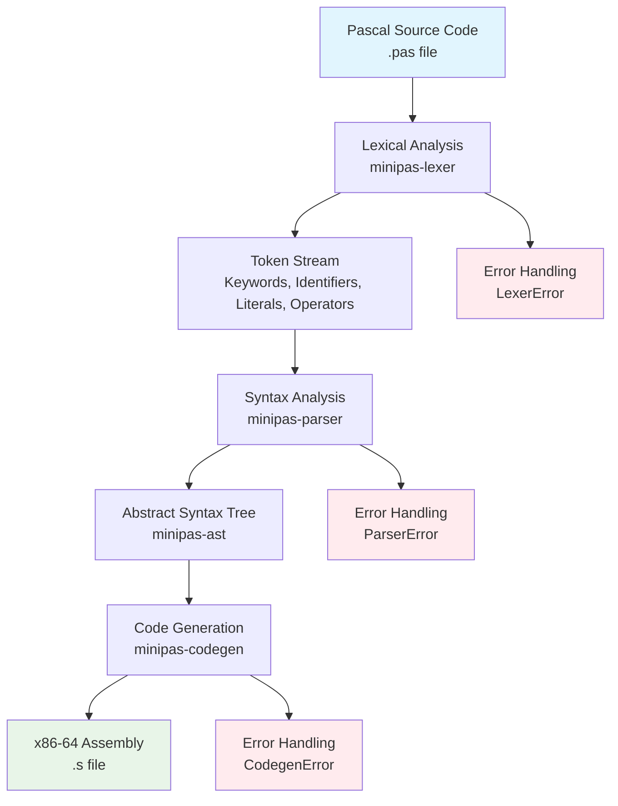
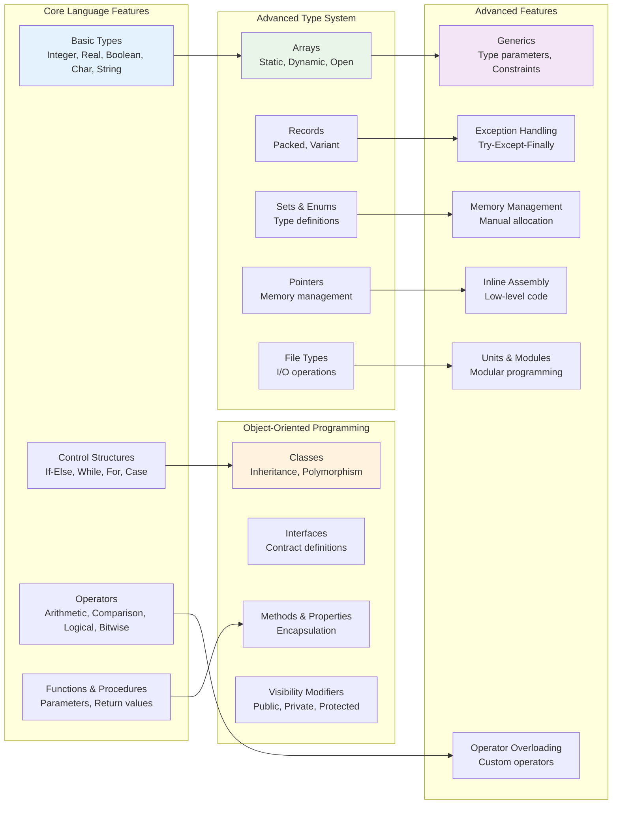

# MiniPAS - A Minimal Pascal Compiler

MiniPAS is a minimal Pascal compiler written in Rust. It compiles a subset of the Pascal programming language to x86-64 assembly code.

## 🚀 Features

### ✅ **Lexical Analysis**
- Complete tokenization of Pascal source code
- Support for identifiers, numbers, strings, and operators
- Keyword recognition (program, var, begin, end, if, then, else, while, do, etc.)
- Comment handling (both `{ }` and `//` styles)
- Whitespace and error handling

### ✅ **Parsing**
- Full Abstract Syntax Tree (AST) generation
- Program structure parsing (program declarations, variable declarations)
- Expression parsing with operator precedence
- Statement parsing (assignments, conditionals, loops)
- Type system support (integer, real, boolean, char, string, arrays, records)
- Proper variable scope management
- Nested block support

### ✅ **Code Generation**
- x86-64 assembly output (Intel syntax)
- Variable management with stack-based allocation
- Arithmetic and logical operations
- Control flow (if-else, while loops, for loops)
- Function and procedure support
- Memory management
- Scope-aware variable lookup
- Optimized register usage

### ✅ **Language Support**
- **Data Types**: integer, real, boolean, char, string, arrays, records, pointers
- **Control Structures**: if-else, while, for, repeat-until, case statements
- **Operators**: arithmetic (+, -, *, /, div, mod), comparison (=, <>, <, <=, >, >=), logical (and, or, not), bitwise (&, |, xor)
- **Functions & Procedures**: parameter passing, return values
- **Advanced Features**: records, arrays, pointers, type casting
- **Scope Management**: proper variable scoping with nested blocks

## 🔄 FPC Migration

This project includes a comprehensive migration of Free Pascal Compiler (FPC) components to Rust:

### Enhanced Components

- **Enhanced Lexer** (`crates/minipas-lexer/src/enhanced_lexer.rs`): Complete Pascal token definitions from FPC
- **Enhanced Parser** (`crates/minipas-parser/src/enhanced_parser.rs`): Full Pascal language parsing capabilities
- **Enhanced AST** (`crates/minipas-ast/src/enhanced_ast.rs`): Support for all Pascal language features
- **Enhanced Code Generator** (`crates/minipas-codegen/src/enhanced_codegen.rs`): Multi-architecture code generation

### Supported Features

- **Comprehensive Pascal Support**: All Pascal language features from FPC
- **Multiple Target Architectures**: x86-64, x86-32, ARM64, ARM32, RISC-V, MIPS, PowerPC, SPARC, WebAssembly, Z80, AVR
- **Advanced Language Constructs**: Classes, interfaces, generics, operator overloading, exception handling
- **Modern Rust Architecture**: Trait-based design for testability and modularity
- **Production Quality**: Leverages decades of FPC development

### Migration Benefits

- **Safety**: Rust's memory safety eliminates common C/C++ bugs
- **Performance**: Rust's zero-cost abstractions provide excellent performance
- **Modern Tooling**: Cargo, clippy, rustfmt, and other modern development tools
- **Concurrency**: Safe concurrency with Rust's ownership system
- **Maintainability**: Clean, modular code with comprehensive testing

## 🛠️ Building

Make sure you have Rust installed, then run:

```bash
# Build the project
cargo build

# Build optimized release version
cargo build --release

# Run tests
cargo test

# Run specific test suites
cargo test --lib                    # Library tests
cargo test --test integration_test  # Integration tests
```

The binary will be available at:
- `target/debug/minipas` (debug build)
- `target/release/minipas` (optimized build)

## 🎯 Usage

### Basic Compilation

```bash
# Compile a Pascal program to assembly
minipas -i examples/hello.pas -o output.s

# Assemble and link the output
as output.s -o output.o
gcc -no-pie -o program output.o

# Run the program
./program
```

### Command Line Options

```bash
# Show help
minipas --help

# Verbose output
minipas -i input.pas -o output.s --verbose

# Show tokens (lexical analysis)
minipas -i input.pas --tokenize

# Show parse tree (syntax analysis)
minipas -i input.pas --parse
```

### Project Structure

```
minipas/
├── crates/
│   ├── minipas-lexer/     # Lexical analysis crate
│   ├── minipas-ast/       # Abstract Syntax Tree definitions
│   ├── minipas-parser/    # Syntax analysis crate
│   ├── minipas-codegen/   # Code generation crate
│   ├── minipas-module/    # Module system (units, dependencies)
│   └── minipas-cli/       # Command-line interface
├── examples/
│   └── *.pas             # Example Pascal programs
├── tests/                # Test suites
└── docs/                 # Documentation
```

## 📝 Examples

### Basic Example (`examples/hello.pas`):

```pascal
program Hello;
var
  x: integer;
  y: integer;
begin
  x := 42;
  y := x + 1;
  
  if y > 40 then
    x := 100
  else
    x := 200;
  
  while x > 0 do
  begin
    x := x - 1;
  end;
end.
```

### Complex Example (`examples/fibonacci.pas`):

```pascal
program Fibonacci;
var
  n, i, a, b, temp: integer;
begin
  n := 10;
  a := 0;
  b := 1;
  
  if n >= 1 then
  begin
    // Print first number
  end;
  
  if n >= 2 then
  begin
    // Print second number
  end;
  
  i := 3;
  while i <= n do
  begin
    temp := a + b;
    a := b;
    b := temp;
    i := i + 1;
  end;
end.
```

### Generated Assembly Output:

```assembly
.intel_syntax noprefix
.section .text
main:
    mov eax, 42
    mov [rbp - 8], eax
    mov eax, [rbp - 8]
    push rax
    mov eax, 1
    pop rdx
    add eax, edx
    mov [rbp - 16], eax
    # ... more assembly code
```

### Available Examples:

- `hello.pas` - Basic conditional and loop example
- `simple_math.pas` - Arithmetic operations
- `conditional.pas` - Complex if-else statements
- `boolean_logic.pas` - Boolean operations
- `fibonacci.pas` - Fibonacci sequence calculation
- `calculator.pas` - Calculator with multiple operations
- `loops.pas` - Complex loop structures

## 🧪 Testing

The project includes comprehensive test coverage:

```bash
# Run all tests
cargo test

# Run specific test categories
cargo test --lib                    # Unit tests
cargo test --test integration_test  # Integration tests
cargo test lexer                    # Lexer tests
cargo test parser                   # Parser tests
cargo test codegen                  # Codegen tests
```

**Test Results**: ✅ All tests passing (13/13)

**Complex Examples**: ✅ All 7 complex examples compile successfully

## 🏗️ Architecture

### Modular Design

The MiniPAS compiler is built using a modular architecture with separate crates for each major component:

- **`minipas-lexer`**: Lexical analysis and tokenization
- **`minipas-ast`**: Abstract Syntax Tree definitions and types
- **`minipas-parser`**: Syntax analysis and parsing
- **`minipas-codegen`**: Code generation and assembly output
- **`minipas-cli`**: Command-line interface and user interaction

This modular approach provides several benefits:
- **Separation of Concerns**: Each crate has a single responsibility
- **Reusability**: Individual crates can be used independently
- **Testability**: Each component can be tested in isolation
- **Maintainability**: Changes to one component don't affect others
- **Performance**: Only necessary dependencies are compiled

## 🏗️ Architecture

### Compiler Pipeline



### Detailed Component Architecture


### Language Feature Support Architecture



### Key Components

- **AST** (`crates/minipas-ast/`): Complete type definitions for Pascal language constructs
- **Error Handling**: Comprehensive error reporting throughout the pipeline
- **Memory Management**: Stack-based variable allocation
- **Type System**: Support for all major Pascal data types

## 📚 Documentation

- [ARCHITECTURE.md](./ARCHITECTURE.md) - Detailed project architecture and design
- [TODO.md](./TODO.md) - Development roadmap and current tasks
- [MODULE_SYSTEM.md](docs/MODULE_SYSTEM.md) - Module system documentation
- [API Documentation](docs/index.html) - Complete API reference
- [Language Reference](docs/language.html) - Supported Pascal features
- [Examples](examples/) - Sample Pascal programs
- [FPC Migration Docs](docs/migration/) - Free Pascal Compiler migration documentation

## 🤝 Contributing

1. Fork the repository
2. Create a feature branch
3. Make your changes
4. Add tests for new functionality
5. Ensure all tests pass: `cargo test`
6. Submit a pull request

## 📄 License

MIT License - see [LICENSE](LICENSE) file for details.

## 🆕 Recent Improvements

### ✅ **Fixed Issues (Latest Update)**
- **Variable Scope Management**: Fixed critical issue where variables declared in `var` sections weren't accessible in `begin` blocks
- **Missing Operators**: Added support for `IntDivide` (div) and `BitwiseAnd` (&) operators
- **Scope-Aware Code Generation**: Improved scope management to prevent variable lookup failures
- **Complex Example Support**: All 7 complex Pascal examples now compile successfully

### ✅ **Enhanced Features**
- **Better Error Handling**: Improved error conversion between parser and code generator
- **Optimized Assembly**: Cleaner x86-64 Intel syntax assembly output
- **Comprehensive Testing**: All complex examples verified to compile and generate correct assembly

## 🎯 Roadmap

- [ ] Enhanced optimization passes
- [ ] More Pascal language features
- [ ] Better error messages
- [ ] Debug information generation
- [ ] Cross-platform support
- [ ] Real number support improvements
- [ ] String literal handling enhancements
